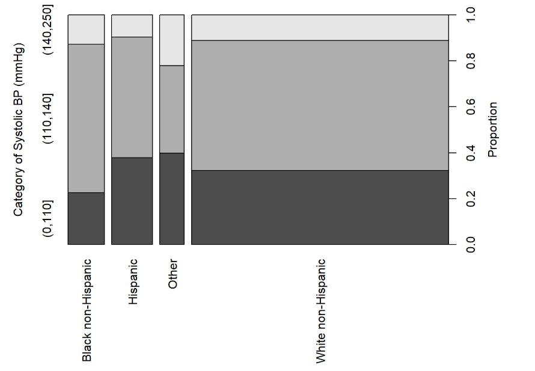
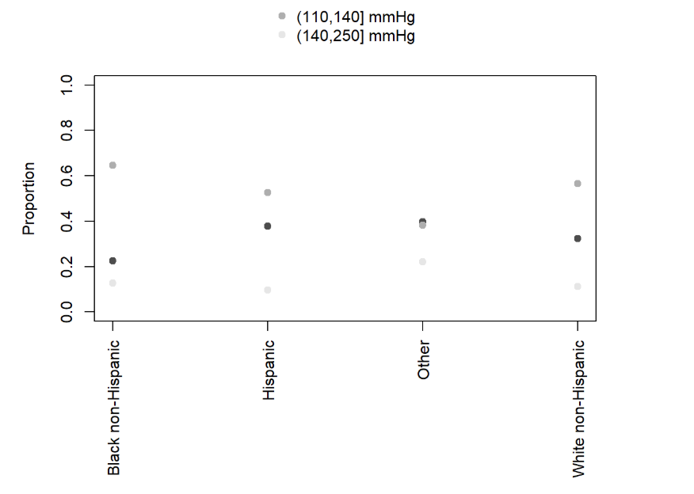
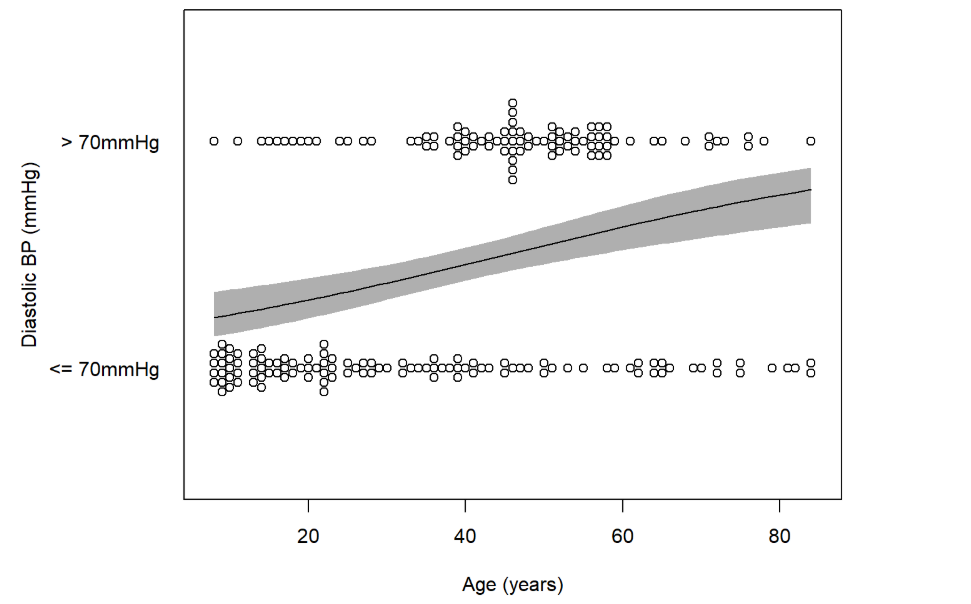
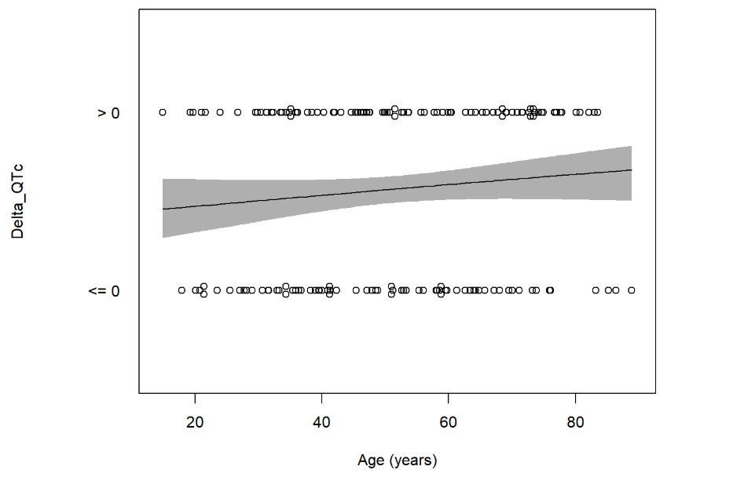
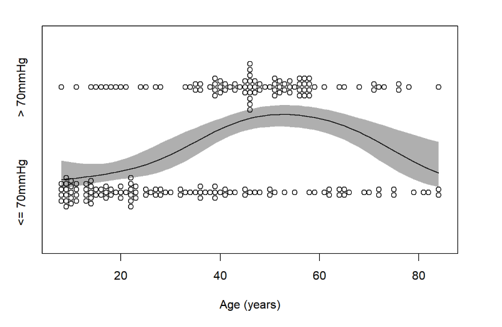
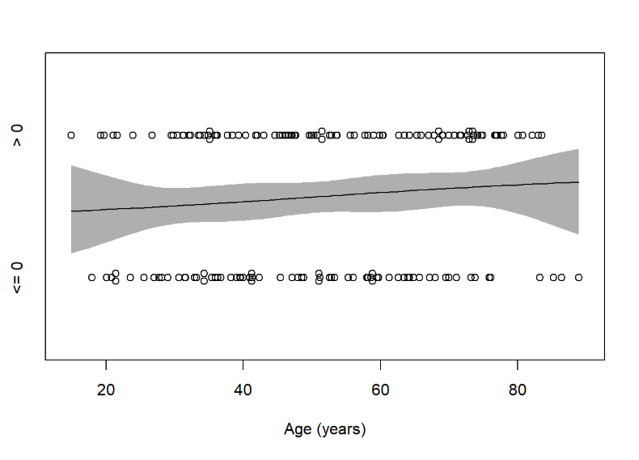
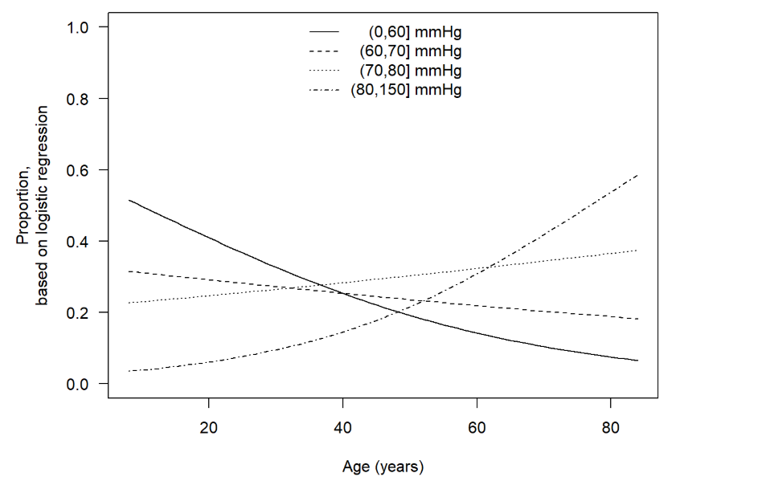
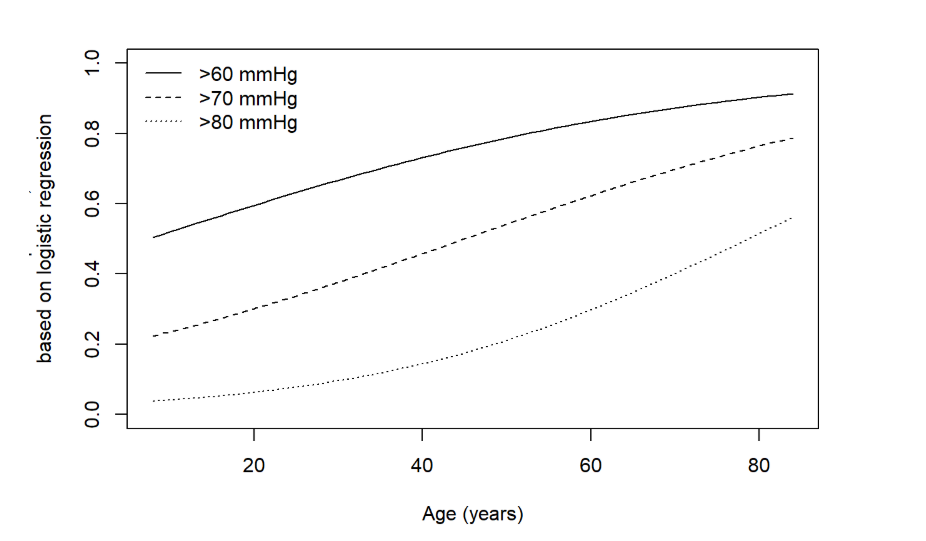
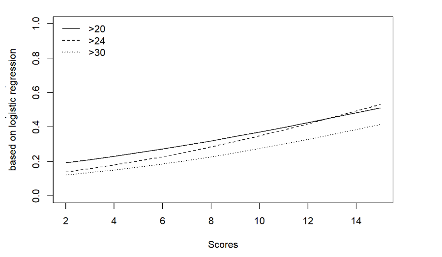
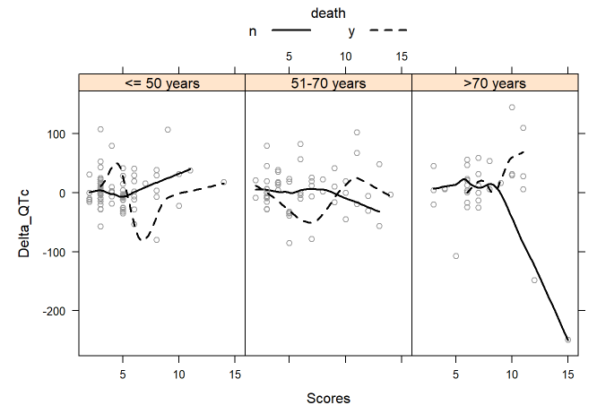

```{r setup, include=FALSE}
knitr::opts_chunk$set(echo = TRUE)
```
 
### Categorical versus categorical




---
### Categorical versus categorical




---
### Categorical versus continuous
### Two categories



---
### Categorical versus continuous-Delta_QTc




---

### Categorical versus continuous
### ns ()



---

### Categorical versus continuous-Delta_QTc



---

### Categorical versus continuous
#### more than 2Catories





---

### Categorical versus continuous


---

### Categorical versus continuous-Delta_QTc dataset




---

### Categorical versus continuousl-Delta_QTc dataset




---

### Graphs illustrating more than two variables


---

### Graphs illustrating more than two variables-Delta_QTc dataset


---


